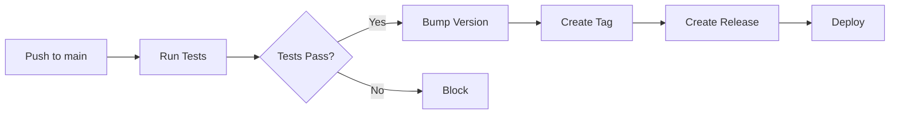

# 🔢 Guia de Versionamento Semântico Automático

## 📖 Visão Geral

Este projeto implementa **Semantic Versioning 2.0.0** com versionamento **totalmente automático** baseado nas mensagens de commit seguindo o padrão **Conventional Commits**.

## 🎯 Como Funciona

### Regras de Versionamento

| Tipo de Commit | Bump de Versão | Exemplo |
|---------------|----------------|---------|
| `feat!` ou `BREAKING CHANGE` | **MAJOR** (x.0.0) | `1.0.0` → `2.0.0` |
| `feat` | **MINOR** (0.x.0) | `1.0.0` → `1.1.0` |
| `fix` | **PATCH** (0.0.x) | `1.0.0` → `1.0.1` |
| Outros tipos | Sem bump | `1.0.0` → `1.0.0` |

### Exemplos Práticos

```bash
# Patch version (1.0.0 → 1.0.1)
git commit -m "fix: corrigir erro no cálculo de domínios"

# Minor version (1.0.0 → 1.1.0)
git commit -m "feat: adicionar visualização 3D"

# Major version (1.0.0 → 2.0.0)
git commit -m "feat!: refatorar API de análise semântica"
# ou
git commit -m "feat: nova API

BREAKING CHANGE: Remove método legado analyze()"
```

## 🚀 Fluxos de Trabalho

### 1. Versionamento Automático no CI

**Quando:** Push para `main` ou `develop`

**O que acontece:**
1. ✅ GitHub Actions analisa commits desde última tag
2. 📊 Determina tipo de bump baseado nos commits
3. 🔢 Atualiza arquivo `VERSION`
4. 🏷️ Cria tag Git `vX.Y.Z`
5. 📝 Cria GitHub Release com changelog automático
6. 🚀 Push das mudanças de volta ao repo

**Workflow:** `.github/workflows/auto-version.yml`

### 2. Versionamento Local (Manual)

```bash
# Testar sem fazer mudanças (dry-run)
npm run version:bump -- --dry-run

# Criar nova versão e tag localmente
npm run version:bump -- --tag

# Enviar tags ao GitHub
git push --tags
```

## 📂 Estrutura de Arquivos

```
projeto/
├── VERSION                          # Versão atual (ex: 1.2.3)
├── .github/
│   └── workflows/
│       └── auto-version.yml        # Workflow de versionamento
└── scripts/
    └── bump-version.ts             # Script de análise e bump
```

## 📊 Arquivo VERSION

**Localização:** `VERSION` (raiz do projeto)

**Formato:** Semantic Versioning (MAJOR.MINOR.PATCH)

**Exemplo:**
```
1.2.3
```

**Por que não usar `package.json`?**
- O `package.json` é read-only no Lovable
- Arquivo separado é mais flexível e independente de plataforma
- Permite controle manual quando necessário

## 🔍 Análise de Commits

O script `bump-version.ts` analisa commits desde a última tag:

```typescript
// Detecta BREAKING CHANGES
commit.includes('BREAKING CHANGE') || /^feat!/.test(commit)

// Detecta Features
/^feat(\(.+\))?:/.test(commit)

// Detecta Bug Fixes
/^fix(\(.+\))?:/.test(commit)
```

## 🎨 Outputs do Script

### Modo Normal
```bash
$ npm run version:bump

🔢 Sistema de Versionamento Semântico

📌 Versão atual: 1.0.0
📝 Commits analisados: 5

🎯 Tipo de bump: MINOR
✨ Nova versão: 1.1.0

✨ Features:
   - feat: adicionar visualização de galáxia
   - feat(corpus): implementar análise de prosódia

🐛 Fixes:
   - fix: corrigir cálculo de frequência normalizada

✅ Arquivo VERSION atualizado para 1.1.0
✅ Tag v1.1.0 criada localmente
💡 Execute 'git push --tags' para enviar ao GitHub

✅ Versionamento concluído com sucesso!
```

### Modo Dry-Run
```bash
$ npm run version:bump -- --dry-run

🔢 Sistema de Versionamento Semântico

📌 Versão atual: 1.0.0
📝 Commits analisados: 5

🎯 Tipo de bump: MINOR
✨ Nova versão: 1.1.0

🔍 Modo dry-run: Nenhuma alteração será feita
```

## 🏷️ Tags e Releases

### Formato de Tags
- **Padrão:** `vX.Y.Z` (ex: `v1.2.3`)
- **Criadas automaticamente** no CI
- **Enviadas automaticamente** ao GitHub

### GitHub Releases
Criadas automaticamente com:
- 📝 Changelog categorizado (Features, Fixes, Breaking Changes)
- 🏷️ Linked à tag correspondente
- ⚠️ Marcada como pre-release se versão major for 0

## 🔄 Integração com CI/CD

O versionamento está integrado aos outros workflows:



## 📋 Comandos NPM

Adicione ao `package.json`:

```json
{
  "scripts": {
    "version:bump": "tsx scripts/bump-version.ts",
    "version:dry-run": "tsx scripts/bump-version.ts --dry-run",
    "version:current": "cat VERSION"
  }
}
```

## 🎯 Boas Práticas

### ✅ Faça
- Use mensagens de commit no formato Conventional Commits
- Execute `npm run version:bump -- --dry-run` antes de criar tags manualmente
- Revise o changelog gerado automaticamente
- Use `feat!` ou `BREAKING CHANGE` para mudanças incompatíveis

### ❌ Não Faça
- Editar arquivo `VERSION` manualmente sem fazer commit
- Criar tags manualmente sem usar o script
- Fazer commits que não seguem Conventional Commits
- Pular versões manualmente

## 🔍 Troubleshooting

### Versão não foi atualizada
**Causa:** Commits não seguem padrão Conventional Commits
**Solução:** Verificar mensagens de commit com `git log`

### Tag já existe
**Causa:** Tag com mesmo número já foi criada
**Solução:** Deletar tag local e remota:
```bash
git tag -d v1.0.0
git push --delete origin v1.0.0
```

### Workflow falhou
**Causa:** Permissões insuficientes
**Solução:** Verificar `Settings` → `Actions` → `General` → `Workflow permissions`

## 📚 Referências

- [Semantic Versioning 2.0.0](https://semver.org/)
- [Conventional Commits](https://www.conventionalcommits.org/)
- [GitHub Actions](https://docs.github.com/en/actions)

## 🔗 Arquivos Relacionados

- [`.github/workflows/auto-version.yml`](../workflows/auto-version.yml) - Workflow de versionamento
- [`scripts/bump-version.ts`](../../scripts/bump-version.ts) - Script principal
- [`VERSION`](../../VERSION) - Arquivo de versão atual
- [`CONTRIBUTING.md`](../../CONTRIBUTING.md) - Guia de contribuição

---

**Última atualização:** 2024  
**Versão do guia:** 1.0.0
