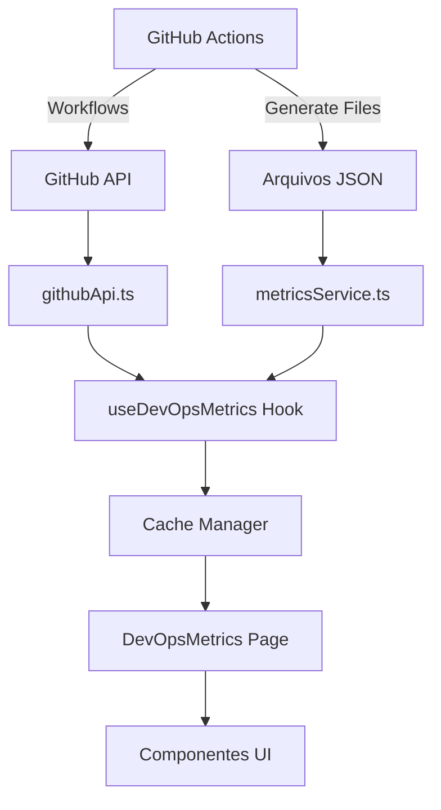

# Sistema DevOps Completo - Documentação Final

## 📋 Índice

1. [Visão Geral](#visão-geral)
2. [Arquitetura do Sistema](#arquitetura-do-sistema)
3. [Guia de Configuração](#guia-de-configuração)
4. [Integrações](#integrações)
5. [Funcionalidades](#funcionalidades)
6. [Exportação de Relatórios](#exportação-de-relatórios)
7. [Sistema de Alertas](#sistema-de-alertas)
8. [Configurações Avançadas](#configurações-avançadas)
9. [Troubleshooting](#troubleshooting)

---

## 🎯 Visão Geral

O Sistema DevOps completo é uma solução integrada que monitora, analisa e reporta métricas de CI/CD, qualidade de código e integridade do corpus em tempo real. 

### Principais Características

✅ **Dashboard Interativo em Tempo Real**
- Visualização de status de workflows do GitHub Actions
- Histórico completo de testes com gráficos
- Métricas do corpus linguístico
- Timeline de releases

✅ **Sistema de Alertas Inteligente**
- Alertas automáticos para workflows falhados
- Notificações de cobertura baixa
- Avisos de degradação de performance

✅ **Exportação Profissional**
- Relatórios em PDF com múltiplas páginas
- Exportação para Excel/CSV
- Relatórios executivos customizáveis

✅ **Configuração Flexível**
- Auto-refresh configurável
- Thresholds personalizáveis
- Seções visíveis sob demanda
- Esquemas de cores acessíveis

---

## 🏗️ Arquitetura do Sistema

### Componentes Principais

```
src/
├── services/devops/          # Serviços de API
│   ├── githubApi.ts         # Integração com GitHub API
│   └── metricsService.ts    # Leitura de arquivos de métricas
├── hooks/
│   └── useDevOpsMetrics.ts  # Hook principal para dados
├── utils/devops/
│   ├── cacheManager.ts      # Sistema de cache
│   ├── exportToPdf.ts       # Exportação PDF
│   └── exportToExcel.ts     # Exportação Excel/CSV
├── components/devops/       # Componentes UI
│   ├── WorkflowStatusCard.tsx
│   ├── TestHistoryChart.tsx
│   ├── CoverageChart.tsx
│   ├── CorpusMetricsCard.tsx
│   ├── ReleasesTimeline.tsx
│   ├── AlertsPanel.tsx
│   ├── RefreshButton.tsx
│   ├── ExportMenu.tsx
│   └── DashboardSettings.tsx
├── types/
│   └── devops.types.ts      # Interfaces TypeScript
└── pages/
    └── DevOpsMetrics.tsx    # Página principal
```

### Fluxo de Dados



---

## ⚙️ Guia de Configuração

### 1. Configuração Inicial

#### Modo Mock (Demonstração)
Por padrão, o sistema funciona em **modo mock** com dados simulados. Para testar rapidamente:

```typescript
// Em src/hooks/useDevOpsMetrics.ts
const MOCK_MODE = true;
```

#### Modo Produção (GitHub Real)

Para conectar ao GitHub real:

```typescript
// Em src/hooks/useDevOpsMetrics.ts
const MOCK_MODE = false;

// Configure o repositório
import { githubApi } from '@/services/devops/githubApi';

githubApi.setRepository(
  'seu-usuario',      // owner
  'seu-repositorio',  // repo
  'seu-token'         // token (opcional, mas recomendado)
);
```

### 2. Obter GitHub Token (Opcional mas Recomendado)

1. Acesse: https://github.com/settings/tokens
2. Click em "Generate new token (classic)"
3. Selecione os escopos:
   - `repo` (acesso aos repositórios)
   - `workflow` (acesso aos workflows)
4. Copie o token gerado
5. Configure no código ou use uma variável de ambiente

**⚠️ IMPORTANTE:** Nunca commite tokens no código! Use secrets ou variáveis de ambiente.

### 3. Configuração dos Workflows

Os workflows já devem estar configurados para gerar os arquivos de métricas:

**Arquivos esperados:**
- `/badges/metrics.json` - Métricas gerais
- `/test-reports/latest.json` - Último relatório de testes
- `/test-reports/history.json` - Histórico de testes
- `/VERSION` - Versão atual do projeto

---

## 🔗 Integrações

### GitHub API

A integração com o GitHub API permite:
- Buscar status de workflows em tempo real
- Listar releases publicadas
- Obter informações do repositório
- Listar branches disponíveis

**Cache:** Todas as chamadas à API são cacheadas por 5 minutos para reduzir rate limiting.

**Rate Limiting:**
- Sem token: 60 requests/hora
- Com token: 5000 requests/hora

### Arquivos Gerados pelos Workflows

Os workflows do CI/CD geram arquivos JSON que o dashboard consome:

#### `badges/metrics.json`
```json
{
  "version": "1.3.0",
  "testsPassed": 45,
  "testsTotal": 45,
  "coverage": 97.8,
  "corpusWords": 4250,
  "corpusLemmas": 3890,
  "corpusDomains": 42,
  "lastUpdate": "2024-11-16T12:00:00Z"
}
```

#### `test-reports/latest.json`
```json
{
  "timestamp": "2024-11-16T12:00:00Z",
  "totalTests": 45,
  "passedTests": 45,
  "failedTests": 0,
  "coverage": 97.8,
  "duration": 135,
  "categories": {
    "Validação": { "total": 15, "passed": 15, "failed": 0 },
    "Integridade": { "total": 12, "passed": 12, "failed": 0 }
  }
}
```

---

## 🎛️ Funcionalidades

### 1. Dashboard Principal

O dashboard exibe 4 cards de resumo:
- **Taxa de Sucesso:** % de workflows bem-sucedidos
- **Cobertura de Testes:** % de código coberto por testes
- **Tempo Médio CI:** Tempo médio de execução dos workflows
- **Última Release:** Versão mais recente publicada

### 2. Status dos Workflows

Mostra todos os workflows do repositório com:
- Nome do workflow
- Status (success, failure, in_progress, pending)
- Última execução (tempo relativo)
- Duração da execução
- Branch onde foi executado
- Link direto para o workflow no GitHub

### 3. Histórico de Testes

Gráfico de linhas mostrando:
- Tendência de testes aprovados vs falhados
- Evolução da cobertura ao longo do tempo
- Taxa de aprovação atual com indicador de tendência

### 4. Cobertura de Testes

Gráfico de pizza com:
- Distribuição de testes por categoria
- Percentual total de cobertura
- Avaliação qualitativa (Excelente, Boa, Regular, Baixa)

### 5. Métricas do Corpus

Cards mostrando:
- Total de palavras no corpus
- Lemas validados
- Domínios semânticos
- Cada métrica com barra de progresso e variação percentual

### 6. Timeline de Releases

Lista cronológica de releases com:
- Número da versão
- Data de publicação
- Tipo de release (major, minor, patch)
- Contadores de features, fixes e breaking changes
- Badge "Latest" para a release mais recente
- Links diretos para as releases no GitHub

---

## 📊 Exportação de Relatórios

### PDF Completo

Gera um relatório profissional em PDF com:
- Header com título e data de geração
- Resumo executivo com métricas principais
- Status detalhado de todos os workflows
- Tabela com histórico de testes
- Métricas do corpus
- Footer com paginação

**Como usar:**
```typescript
import { exportDashboardToPdf } from '@/utils/devops/exportToPdf';

// No componente
<Button onClick={() => exportDashboardToPdf(metrics)}>
  Exportar PDF
</Button>
```

### CSV/Excel

Exporta dados em formato tabular:

**CSV Completo:**
Inclui todas as seções em um único arquivo CSV com separadores.

**CSVs Individuais:**
- `workflows-YYYY-MM-DD.csv`
- `test-history-YYYY-MM-DD.csv`
- `corpus-metrics-YYYY-MM-DD.csv`

**Como usar:**
```typescript
import { exportMetricsToCSV, exportWorkflowsToCSV } from '@/utils/devops/exportToExcel';

// Exportar tudo
<Button onClick={() => exportMetricsToCSV(metrics)}>CSV Completo</Button>

// Exportar workflows apenas
<Button onClick={() => exportWorkflowsToCSV(metrics)}>Workflows CSV</Button>
```

---

## 🚨 Sistema de Alertas

### Tipos de Alertas

1. **Critical (Crítico)**
   - Workflows falharam
   - Cor: Vermelho
   - Ação: Investigar imediatamente

2. **Warning (Aviso)**
   - Cobertura abaixo do threshold
   - Taxa de sucesso baixa
   - Cor: Amarelo
   - Ação: Monitorar e planejar correção

3. **Info (Informação)**
   - Notificações gerais
   - Cor: Azul
   - Ação: Apenas informativo

### Configuração de Thresholds

Os limites que geram alertas podem ser configurados:

```typescript
thresholds: {
  minCoverage: 80,     // Alerta se cobertura < 80%
  maxCITime: 300,      // Alerta se CI > 5 minutos
}
```

### Gerenciamento de Alertas

- **Marcar como lido:** Clique no alerta para expandir
- **Descartar:** Click no X para remover (apenas dismissible)
- **Persistência:** Alertas lidos/descartados são salvos no localStorage

---

## ⚡ Configurações Avançadas

### Auto-Refresh

Configure o intervalo de atualização automática:

- **Desligado:** Nenhuma atualização automática
- **10 segundos:** Para monitoramento em tempo real
- **30 segundos:** Padrão recomendado
- **1 minuto:** Para economia de recursos
- **5 minutos:** Para visualização esporádica

### Seções Visíveis

Controle quais seções aparecem no dashboard:
- ☑️ Workflows
- ☑️ Histórico de Testes
- ☑️ Cobertura de Testes
- ☑️ Métricas do Corpus
- ☑️ Timeline de Releases

**Dica:** Desabilite seções que não são relevantes para você para acelerar o carregamento.

### Esquemas de Cores

Três temas de cores para gráficos:

1. **Padrão:** Cores vibrantes e modernas
2. **Daltonismo:** Cores otimizadas para pessoas com daltonismo
3. **Alto Contraste:** Máximo contraste para acessibilidade

### Cache

O sistema usa cache inteligente em duas camadas:

**Memória (volátil):**
- Cache em RAM durante a sessão
- Extremamente rápido
- Limpo ao recarregar a página

**LocalStorage (persistente):**
- Cache persistente entre sessões
- Útil para dados menos sensíveis ao tempo
- Sobrevive a recarregamentos

**TTL Padrão:** 5 minutos (configurável por tipo de dado)

---

## 🔧 Troubleshooting

### Dashboard Não Carrega

**Sintoma:** Página em branco ou loading infinito

**Soluções:**
1. Verifique o console do navegador (F12)
2. Confirme que está em MOCK_MODE=true se não configurou GitHub
3. Limpe o cache: `localStorage.clear()`
4. Recarregue a página com Ctrl+Shift+R

### Dados Não Atualizam

**Sintoma:** Métricas antigas mesmo após refresh

**Soluções:**
1. Clique no botão "Atualizar" manualmente
2. Verifique se auto-refresh está habilitado
3. Limpe o cache usando as configurações
4. Verifique se os workflows do CI estão gerando os arquivos

### GitHub API Rate Limit

**Sintoma:** Erro "API rate limit exceeded"

**Soluções:**
1. Configure um GitHub token pessoal
2. Aumente o intervalo de auto-refresh
3. Aguarde 1 hora (rate limit reseta a cada hora)

### Exportação PDF Falha

**Sintoma:** Erro ao gerar PDF

**Soluções:**
1. Verifique se `jspdf` e `html2canvas` estão instalados
2. Desabilite bloqueadores de popup
3. Tente com menos dados (filtre por data)
4. Verifique o console para erros específicos

### Performance Lenta

**Sintoma:** Dashboard demora para carregar ou responder

**Soluções:**
1. Desabilite seções não essenciais
2. Aumente o TTL do cache
3. Reduza o histórico de testes mostrado
4. Use o modo mock para testes
5. Verifique sua conexão de internet

---

## 📈 Métricas de Qualidade

### Cobertura de Testes

| Nível | Percentual | Avaliação |
|-------|-----------|-----------|
| 🟢 Excelente | ≥ 90% | Altamente confiável |
| 🟢 Boa | 80-89% | Confiável |
| 🟡 Regular | 70-79% | Precisa melhorar |
| 🔴 Baixa | < 70% | Crítico |

### Taxa de Sucesso

| Nível | Percentual | Status |
|-------|-----------|--------|
| 🟢 Excelente | 100% | Todos workflows OK |
| 🟡 Boa | 90-99% | Alguns problemas |
| 🔴 Crítica | < 90% | Investigar urgente |

---

## 🚀 Próximos Passos

Agora que o sistema DevOps está completo, você pode:

1. **Retornar ao desenvolvimento do produto principal**
   - Análise semântica do corpus
   - Visualizações interativas
   - Funcionalidade KWIC
   - Modo avançado de linguística

2. **Monitorar a qualidade continuamente**
   - Usar o dashboard diariamente
   - Configurar alertas
   - Exportar relatórios semanais

3. **Evoluir o sistema DevOps (futuro)**
   - Integração com Slack/Discord
   - Notificações por email
   - Dashboards customizados por equipe
   - Métricas de performance de código

---

## 📞 Suporte

Para dúvidas ou problemas:
1. Consulte este guia
2. Verifique a seção de troubleshooting
3. Revise os logs do console
4. Abra uma issue no repositório

---

**Última atualização:** 16 de Novembro de 2024  
**Versão do Sistema:** 1.0.0  
**Status:** ✅ Produção
